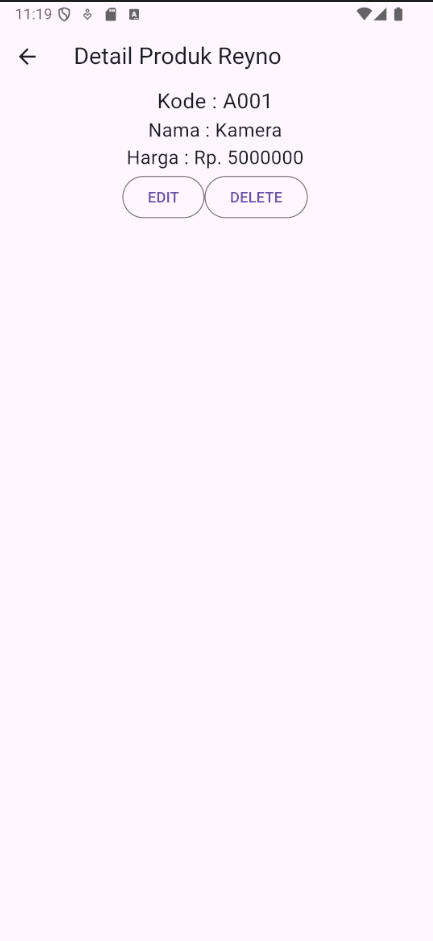
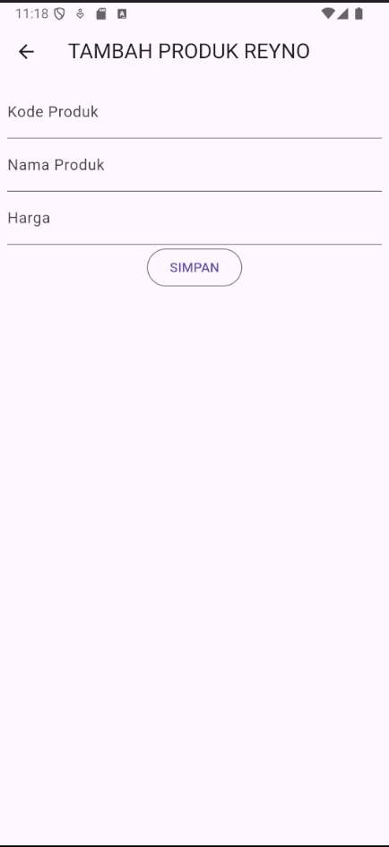
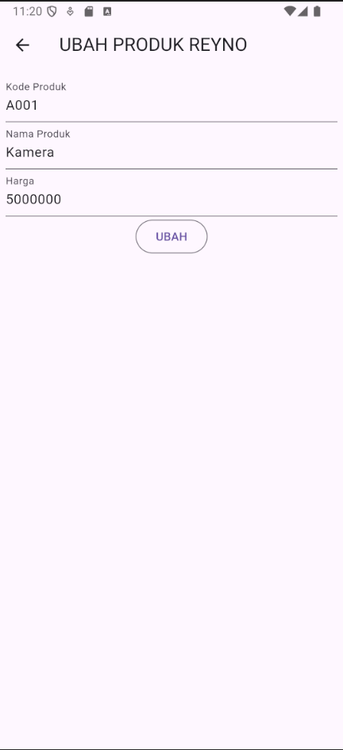

# Tugas Pertemuan 5

Nama : Reyno Alfarez Marchelian

NIM : H1D022111

Shift Baru: B

## Penjelasan

### Registrasi


- Halaman memiliki beberapa TextFields untuk input nama, email, dan password, termasuk konfirmasi password.
- Setiap TextField memiliki validasi untuk memastikan input memenuhi kriteria, misalnya, nama harus minimal 3 karakter, email harus valid, dan password minimal 6 karakter.
- Tombol "Registrasi" akan memeriksa validasi formulir terlebih dahulu.
- Jika valid, tombol akan memanggil fungsi `_submit()` untuk mengirim data registrasi.
- Fungsi `_submit()` menggunakan `RegistrasiBloc` untuk mengirim data ke backend dan menampilkan dialog.
- Jika registrasi berhasil, dialog sukses akan muncul, meminta pengguna untuk login.
- Jika gagal, dialog peringatan akan muncul.

```
RegistrasiBloc.registrasi(
            nama: _namaTextboxController.text,
            email: _emailTextboxController.text,
            password: _passwordTextboxController.text)
        .then((value) {
      showDialog(
          context: context,
          barrierDismissible: false,
          builder: (BuildContext context) => SuccessDialog(
                description: "Registrasi berhasil, silahkan login",
                okClick: () {
                  Navigator.pop(context);
                },
              ));
    }, onError: (error) {
      showDialog(
          context: context,
          barrierDismissible: false,
          builder: (BuildContext context) => const WarningDialog(
                description: "Registrasi gagal, silahkan coba lagi",
              ));
    });

```

- `RegistrasiBloc.registrasi(...)` memanggil fungsi registrasi dari `RegistrasiBloc`, mengirim data nama, email, dan password yang diinput pengguna.
- Fungsi ini menggunakan `then(...)` untuk menangani hasil registrasi:
   - Jika Berhasil: Menampilkan `SuccessDialog` dengan pesan "Registrasi berhasil, silahkan login".
   - Jika Gagal: Menampilkan `WarningDialog` dengan pesan "Registrasi gagal, silahkan coba lagi".

### Login


- Terdapat dua kolom input, yaitu untuk email dan password, dengan masing-masing memiliki validasi sederhana. Email harus diisi, dan password tidak boleh kosong.
- Tombol "Login" akan memeriksa validitas form menggunakan `_formKey`. Jika valid dan tidak dalam kondisi loading, metode `_submit()` akan dipanggil.
- Terdapat tautan teks "Registrasi" di bagian bawah, yang mengarahkan pengguna ke halaman `RegistrasiPage` untuk mendaftar jika belum memiliki akun.
- Metode _submit() melakukan autentikasi melalui LoginBloc.login(), mengirim data email dan password ke server.
  - Jika Berhasil:
     Token dan userID disimpan melalui UserInfo() dan kemudian 
      Halaman akan berpindah ke ProdukPage.
   - Jika Gagal: Tampilkan dialog peringatan menggunakan WarningDialog dengan pesan "Login gagal, silahkan coba lagi".
     
  ```
    LoginBloc.login(
            email: _emailTextboxController.text,
            password: _passwordTextboxController.text)
        .then((value) async {
      if (value.code == 200) {
        await UserInfo().setToken(value.token.toString());
        await UserInfo().setUserID(int.parse(value.userID.toString()));
        Navigator.pushReplacement(context,
            MaterialPageRoute(builder: (context) => const ProdukPage()));
      } else {
        showDialog(
            context: context,
            barrierDismissible: false,
            builder: (BuildContext context) => const WarningDialog(
                  description: "Login gagal, silahkan coba lagi",
                ));
      }
    }, onError: (error) {
      print(error);
      showDialog(
          context: context,
          barrierDismissible: false,
          builder: (BuildContext context) => const WarningDialog(
                description: "Login gagal, silahkan coba lagi",
              ));
    });
   ```

- `LoginBloc.login(...)` mengirimkan data email dan password ke server untuk melakukan login.
- Jika Login Berhasil (kondisi `if (value.code == 200)`):
   - Token dan userID disimpan dengan `UserInfo()`, yang membantu mengelola sesi pengguna.
   - Aplikasi kemudian menavigasi ke halaman `ProdukPage` menggunakan `Navigator.pushReplacement()`.
- Jika Login Gagal:
   - Menampilkan dialog peringatan (`WarningDialog`) dengan pesan "Login gagal, silahkan coba lagi".
- Jika ada error lain selama proses login (seperti masalah koneksi), dialog peringatan tetap ditampilkan.

### List Produk


```
actions: [
  Padding(
    padding: const EdgeInsets.only(right: 20.0),
    child: GestureDetector(
      child: const Icon(Icons.add, size: 26.0),
      onTap: () async {
        Navigator.push(context,
            MaterialPageRoute(builder: (context) => ProdukForm()));
      },
    )
  )
],

```

- Terdapat tombol di `AppBar` untuk menambah produk baru, yang mengarahkan ke halaman `ProdukForm` saat diklik.

```
drawer: Drawer(
  child: ListView(
    children: [
      ListTile(
        title: const Text('Logout'),
        trailing: const Icon(Icons.logout),
        onTap: () async {
          await LogoutBloc.logout().then((value) => {
            Navigator.of(context).pushAndRemoveUntil(
                MaterialPageRoute(builder: (context) => LoginPage()),
                (route) => false)
          });
        },
      )
    ],
  ),
),

```

- Menu navigasi (drawer) di samping berisi tombol untuk logout, yang akan mengembalikan pengguna ke halaman `LoginPage` setelah logout.

```
body: FutureBuilder<List>(
  future: ProdukBloc.getProduks(),
  builder: (context, snapshot) {
    if (snapshot.hasError) print(snapshot.error);
    return snapshot.hasData
        ? ListProduk(
            list: snapshot.data,
          )
        : const Center(
            child: CircularProgressIndicator(),
        );
  },
),
```

- Menggunakan `FutureBuilder` untuk memuat data produk dari `ProdukBloc.getProduks()`.

```
return snapshot.hasData
    ? ListProduk(
        list: snapshot.data,
      )
    : const Center(
        child: CircularProgressIndicator(),
    );

```
- Jika data tersedia, `ListProduk` menampilkan daftar produk dalam bentuk list; jika belum tersedia, indikator loading (`CircularProgressIndicator`) ditampilkan.

```
class ListProduk extends StatelessWidget {
  final List? list;
  const ListProduk({Key? key, this.list}) : super(key: key);
  @override
  Widget build(BuildContext context) {
    return ListView.builder(
        itemCount: list == null ? 0 : list!.length,
        itemBuilder: (context, i) {
          return ItemProduk(
            produk: list![i],
          );
        });
  }
}

```

- `ListProduk` menampilkan daftar item produk dengan widget `ListView.builder`.

```
class ItemProduk extends StatelessWidget {
  final Produk produk;
  const ItemProduk({Key? key, required this.produk}) : super(key: key);
  @override
  Widget build(BuildContext context) {
    return GestureDetector(
      onTap: () {
        Navigator.push(
            context,
            MaterialPageRoute(
                builder: (context) => ProdukDetail(
                  produk: produk,
                )));
      },
      child: Card(
        child: ListTile(
          title: Text(produk.namaProduk!),
          subtitle: Text(produk.hargaProduk.toString()),
        ),
      ),
    );
  }
}
```

- Setiap produk diwakili oleh `ItemProduk`, yang menampilkan nama dan harga produk di dalam `ListTile`.

```
onTap: () {
  Navigator.push(
      context,
      MaterialPageRoute(
          builder: (context) => ProdukDetail(
                produk: produk,
              )));
},
```
- Ketika pengguna mengetuk suatu produk, mereka akan diarahkan ke halaman `ProdukDetail` untuk melihat detail lengkap produk tersebut.

### Detail Produk



### Tambah Produk



```
simpan() {
  setState(() {
    _isLoading = true;
  });
  Produk createProduk = Produk(id: null);
  createProduk.kodeProduk = _kodeProdukTextboxController.text;
  createProduk.namaProduk = _namaProdukTextboxController.text;
  createProduk.hargaProduk = int.parse(_hargaProdukTextboxController.text);
  ProdukBloc.addProduk(produk: createProduk).then((value) {
    Navigator.of(context).push(MaterialPageRoute(
        builder: (BuildContext context) => const ProdukPage()));
  }, onError: (error) {
    showDialog(
        context: context,
        builder: (BuildContext context) => const WarningDialog(
              description: "Simpan gagal, silahkan coba lagi",
            ));
  });
  setState(() {
    _isLoading = false;
  });
}
```

Fitur ini memungkinkan pengguna untuk menambahkan produk baru ke dalam sistem. Jika produk yang ditambahkan berhasil disimpan, pengguna akan diarahkan kembali ke halaman daftar produk (`ProdukPage`).

### Ubah Produk



```
ubah() {
  setState(() {
    _isLoading = true;
  });
  Produk updateProduk = Produk(id: widget.produk!.id!);
  updateProduk.kodeProduk = _kodeProdukTextboxController.text;
  updateProduk.namaProduk = _namaProdukTextboxController.text;
  updateProduk.hargaProduk = int.parse(_hargaProdukTextboxController.text);
  ProdukBloc.updateProduk(produk: updateProduk).then((value) {
    Navigator.of(context).push(MaterialPageRoute(
        builder: (BuildContext context) => const ProdukPage()));
  }, onError: (error) {
    showDialog(
        context: context,
        builder: (BuildContext context) => const WarningDialog(
              description: "Permintaan ubah data gagal, silahkan coba lagi",
            ));
  });
  setState(() {
    _isLoading = false;
  });
}
```

- Fitur ini memungkinkan pengguna untuk mengubah detail produk yang sudah ada. Jika data produk berhasil diubah, pengguna juga akan diarahkan kembali ke halaman daftar produk. Formulir akan diisi dengan data produk yang ada ketika halaman dibuka.
- Pada saat halaman `ProdukForm` diinisialisasi, fungsi `isUpdate()` memeriksa apakah objek produk ada. Jika ada, judul dan teks tombol akan diubah menjadi "UBAH PRODUK" dan "UBAH" untuk memberi tahu pengguna bahwa mereka sedang mengubah produk yang sudah ada.
- Jika pengguna menekan tombol SIMPAN atau UBAH, fungsi `simpan()` atau `ubah()` akan dipanggil berdasarkan kondisi produk (baru atau sudah ada).

### Hapus Produk

```
void confirmHapus() {
  AlertDialog alertDialog = AlertDialog(
    content: const Text("Yakin ingin menghapus data ini?"),
    actions: [
      // Tombol hapus
      OutlinedButton(
        child: const Text("Ya"),
        onPressed: () {
          ProdukBloc.deleteProduk(id: int.parse(widget.produk!.id!)).then(
              (value) => {
                    Navigator.of(context).push(MaterialPageRoute(
                        builder: (context) => const ProdukPage()))
                  }, onError: (error) {
            showDialog(
                context: context,
                builder: (BuildContext context) => const WarningDialog(
                      description: "Hapus gagal, silahkan coba lagi",
                    ));
          });
        },
      ),
      // Tombol batal
      OutlinedButton(
        child: const Text("Batal"),
        onPressed: () => Navigator.pop(context),
      )
    ],
  );
  showDialog(builder: (context) => alertDialog, context: context);
}
```

- Fitur ini memungkinkan pengguna untuk menghapus produk dari daftar. Ketika tombol "DELETE" ditekan, pengguna akan diminta untuk mengonfirmasi tindakan penghapusan. Jika pengguna mengonfirmasi, produk akan dihapus dari basis data menggunakan ProdukBloc.deleteProduk(), dan pengguna akan diarahkan kembali ke halaman daftar produk (ProdukPage). Jika penghapusan gagal, dialog peringatan akan ditampilkan.

- AlertDialog: Ketika pengguna menekan tombol "DELETE", fungsi `confirmHapus()` akan dipanggil, menampilkan dialog konfirmasi dengan dua tombol: "Ya" untuk melanjutkan penghapusan dan "Batal" untuk membatalkannya.

- Penghapusan Produk: Jika pengguna mengonfirmasi, `ProdukBloc.deleteProduk()` akan dipanggil dengan id produk sebagai argumen. Jika penghapusan berhasil, pengguna diarahkan kembali ke halaman `ProdukPage`. Jika gagal, dialog peringatan akan ditampilkan untuk memberi tahu pengguna bahwa penghapusan gagal.
